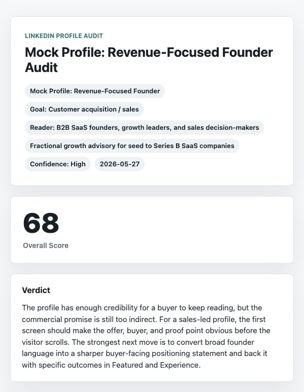

# LI Profile Optimizer Skillset

Analyze a LinkedIn profile from screenshots and get a scored profile audit with prioritized fixes.



## What It Does

This skillset helps Claude, Codex, or Gemini review a LinkedIn profile from screenshots. It scores the profile, explains the evidence behind each score, identifies the highest-impact fixes, and can rewrite the headline and About opening.

Expected output:

- goal-aware overall score
- section scores for hero, About, Featured, Activity, Experience, Skills, and social proof
- prioritized fixes
- suggested headline and About copy
- optional browser-openable HTML report

## Quick Start

1. Install the skillset.
2. Capture your LinkedIn profile screenshot.
3. Upload the screenshot to Claude or Codex.
4. Use the sample prompt below.

## Install

Claude Code:

```bash
claude plugin marketplace add sonarly-io/li-profile-optimizer-skillset
claude plugin install lpo@sonarly
```

Codex:

```bash
codex plugin marketplace add sonarly-io/li-profile-optimizer-skillset
codex plugin add lpo@sonarly
```

Gemini:

Use `platforms/gemini-gems/li-profile-optimizer-skillset.md` as custom Gem instructions.

## Capture Your Profile

Use desktop Chrome:

1. Open your LinkedIn profile.
2. Scroll to the top.
3. Open DevTools: `Option` + `Command` + `I` on Mac, or `Ctrl` + `Shift` + `I` on Windows/Linux.
4. Open Command Menu: `Command` + `Shift` + `P` on Mac, or `Ctrl` + `Shift` + `P` on Windows/Linux.
5. Type `Capture full size screenshot` and press Enter.
6. Upload the downloaded PNG to Claude or Codex.

If full-page capture does not work, upload screenshots of: intro/hero, About, Featured, Activity/posts, Experience, Skills, Recommendations, and Education/certifications.

## Use

```text
Use LI Profile Optimizer Skillset to audit these screenshots. Score each profile section, identify the top fixes, and rewrite the headline and About opening.
```

More targeted prompt:

```text
Use LI Profile Optimizer Skillset to audit my LinkedIn profile for customer acquisition.

Primary reader: B2B SaaS founders and growth leaders.
Goal: make the profile clearer, more credible, and more likely to convert profile visitors into qualified conversations.

Please return:
1. Overall score
2. Section scores
3. Top 5 fixes
4. Suggested headline
5. Suggested About opening
6. Facts I need to confirm before publishing
7. A polished HTML report if possible
```

Example report:

- [Open the mock HTML report](examples/mock-linkedin-profile-audit.html)
- [View the mock data](examples/mock-audit-data.json)

Blur private contact details before uploading screenshots.

## Privacy

Screenshots are processed by the AI provider you use, such as Claude or Codex. Do not upload private contact details, third-party private data, or profiles you do not have permission to analyze.

This skillset gives profile communication feedback only. Do not use it for hiring, compensation, eligibility, credit, legal, insurance, or other high-impact decisions.

## Maintainers

See `CONTRIBUTING.md` and `SECURITY.md`. Run `./scripts/validate.sh` before publishing changes.
